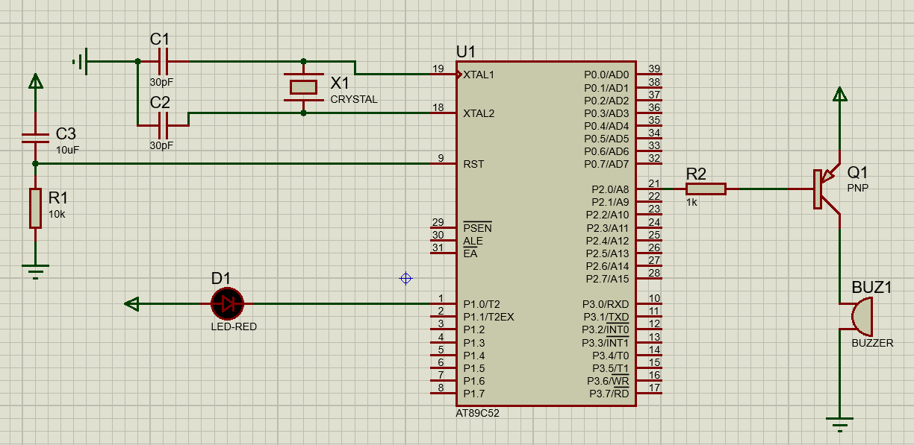
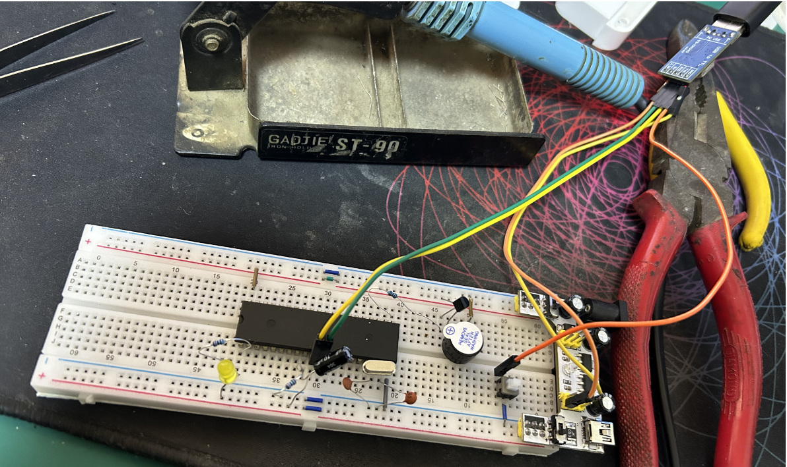
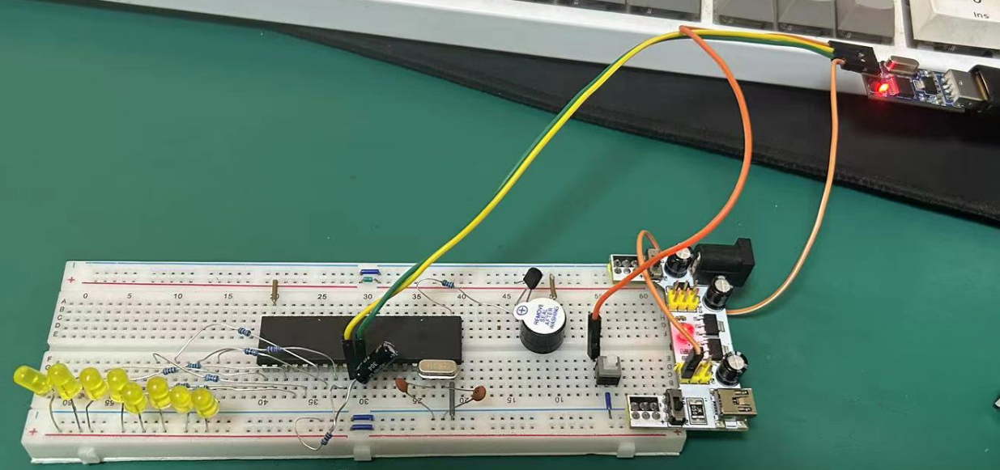

# 000.环境搭建

## 原理图

## 器件工具清单

- STC89C52RC-40C-PDIP40
- 11059200Hz 晶振 `X1`
- 30pF 瓷片电容，`C1, C2`
- 10uF 电解电容，`C3`
- 10K电阻，`R1`
- 1K电阻，`R2`，`LED` 也要用到，不过 `Proteus` 里没画.
- 发光二极管
- PNP三极管，型号 `MLB8550`. 貌似主流是 `S8550`，不过优信电子的客服说参数一样的.
- 5V有源蜂鸣器
- 六脚自锁按键
- 面包板+电源模块
- 跳线杜邦线若干
- CH340下载器
- 电烙铁
- 吸锡器（手残党的救星）

## 面包板电路

## 面包板电路第二版

使用`P1`驱动8个`LED`小灯.

## 参考资料

感谢 [趣玩电子](https://space.bilibili.com/373539912) 老铁的 [入坑单片机](https://space.bilibili.com/373539912/channel/collectiondetail?sid=536055) 系列教程，棒极了！

