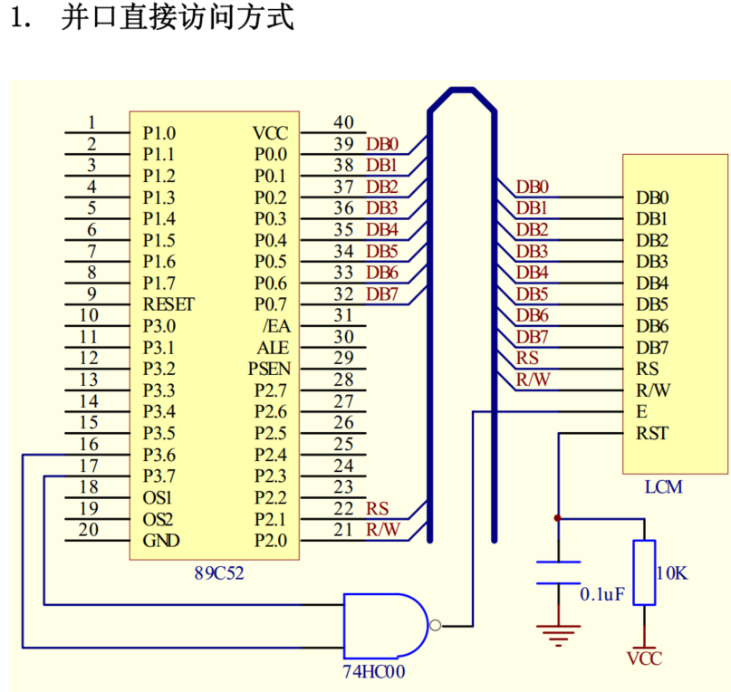

# ST7920 8-bit parallel mode with direct access

**深圳汉晟** 的 `ST7920` 手册里提到了 **并口直接访问方式**

查资料后发现这是把液晶屏当成了单片机的外部存储器使用，有点意思，有空好好研究下. 不过张毅刚视频中提到的外扩 `SRAM 6116, 6264` 等芯片貌似已经停产了，某宝能找到的基本是二手. 是不是现在已经都用 `nvram` 了？

## refs

- [74HC00,在12864里干什么呢？并口如何访问？](http://bbs.eeworld.com.cn/thread-309208-1-1.html)

- [12864液晶并口直接访问与间接访问的区别](http://bbs.eeworld.com.cn/thread-340039-1-1.html#pid1342500)

- [B站张毅刚单片机原理-P19外部存储器的扩展](https://www.bilibili.com/video/BV1KN411o7gV?p=19)

- [Using Arduino to replace a 6264 SRAM chip?](https://forum.arduino.cc/t/using-arduino-to-replace-a-6264-sram-chip/195299)

